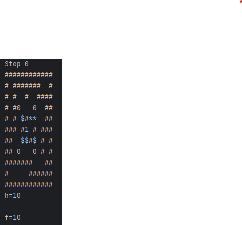
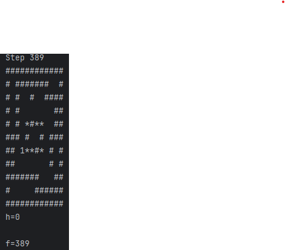

# SOKOBAN AI SOLVER

An AI-based solver for the classic **Sokoban** puzzle, implemented using the **A\*** search algorithm with heuristic evaluation and deadlock detection.

---

## Game Rules

At the start of the program, the user is prompted to select the desired **Sokoban level difficulty**.

- If a solution exists, **each player move** is printed until the final state is reached.
- At every step, the **heuristic value (`h`)** and the **total cost (`f`)** are displayed.
- If no solution exists, an appropriate message is printed.

### Goal State
The objective is to place **each box onto a target**.

- Each target can hold **exactly one box**
- **Multiple boxes on the same target are not allowed**
- The correspondence must be **one-to-one (1–1)**

---

## Symbol Mappings

| Symbol | Meaning              |
|------:|----------------------|
| `1`   | Player               |
| `0`   | Box                  |
| `#`   | Wall                 |
| `$`   | Target               |
| `*`   | Box on Target        |
| `+`   | Player on Target     |

---

## Code Structure

- **Main Entry Point**
  - `Main()`

- **A\* Algorithm Implementation**
  - `AstarAlgorithm()`

- **Core Methods**
  - `isValidMove(...)`
  - `updateGrid(...)`
  - `isDeadlock(...)`

- **Helper Methods**
  - `isCorridorDeadlock(...)`
  - `isItCorner(...)`
  - `checkFourDirections(...)`
  - `noMoneyOrBox(...)`
  - `findPlayer(...)`
  - `copyGrid(...)`
  - `printSolutionPath(...)`
  - `makeRectangularWithBorder(...)`
  - `isGoal(...)`

- **Heuristic & Search Utilities**
  - `heuristic(...)`
  - `isValid(...)`
  - `IDSPlayertobox(...)`
  - `DLS(...)`

- **Node Class**
  - Constructor
  - `equals(...)`
  - `hashCode()`
  - `print()`

---

## File Structure

- **Main.java**  
  Contains the entire codebase **except** the `Node` class.

- **Node.java**  
  Implements the `Node` class, which represents **a single game state** in the search space.

---

## Highlights

- A\* search with heuristic evaluation
- Used IDS algorithm for heuristic implementation
- Deadlock detection for pruning invalid states
- Step-by-step solution visualization

### Example: Sokoban Hard Level Solution (A*)

The following images illustrate the execution of the **A\*** search algorithm on a **hard Sokoban level**.

- **Step 0** shows the initial state of the puzzle.
  - The heuristic value is `h = 10`
  - The total cost is `f = 10`
  - The player, boxes, walls, and targets are represented using the predefined symbol mapping.

- **Step 389** shows the final (goal) state.
  - All boxes have been successfully placed on distinct targets (1–1 correspondence).
  - The heuristic value has reached `h = 0`
  - The total path cost is `f = 389`

This example demonstrates:
- The effectiveness of the A\* algorithm on complex Sokoban configurations
- The gradual reduction of the heuristic value until the goal state is reached
- The use of deadlock detection to avoid invalid or unsolvable states

